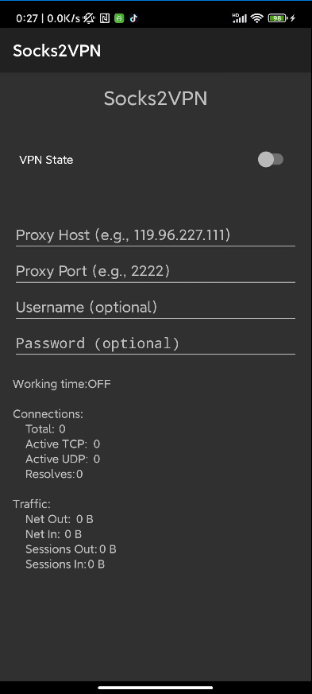

# Socks2VPN for Android

Socks2VPN 是一款将 SOCKS5 代理转换为 VPN 连接的工具



## 🚀 特性

- **免 Root 权限**：用户无需获取 Root 权限即可使用该应用，更加安全和便捷。
- **支持 SOCKS5 代理**：轻松连接到任何 SOCKS5 代理服务器，享受自由的网络访问。
- **用户友好的界面**：直观的用户界面，让用户可以轻松设置和管理代理连接。
- **自动重连接**：保持连接稳定，支持自动重新连接功能。
- **兼容多种网络环境**：适用于各种移动网络和 Wi-Fi 环境。

## 📥 安装
### 成品下载

[Release](https://github.com/Mrack/Socks2VPN/releases)


### 从源代码构建 APK

如果您想从源代码构建 APK，请按照以下步骤操作：

1. 确保您已安装 [Android Studio](https://developer.android.com/studio)。
2. 克隆项目：

   ```bash
   git clone https://github.com/Mrack/Socks2VPN.git
   ./gradlew assembleDebug
   ```


## 📖 使用方法

### 配置 SOCKS5 代理

1. **输入代理信息**：
    - 在主界面上，您将看到用于填写 SOCKS5 代理的信息框。
    - **Proxy Host**：输入您的 SOCKS5 代理服务器地址（例如 `192.168.1.100`）。
    - **Proxy Port**：输入 SOCKS5 代理的端口号（例如 `1080`）。
    - **Username**（可选）：如果您的代理需要身份验证，请输入用户名。
    - **Password**（可选）：如果您的代理需要身份验证，请输入密码。

2**连接到代理**：
    - 在填写完成并保存配置后，点击屏幕顶部的 "连接" 按钮。
    - 应用将显示连接进度，稍等片刻。

3. **确认连接状态**：
    - 如果连接成功，应用将显示状态更改为 “已连接”。
    - 所有网络流量现在将通过您指定的 SOCKS5 代理进行路由。


- **查看连接日志**：
    - 可以在应用内查看 VPN 连接日志，以帮助排查问题。

## ⚙️ 故障排除

- **无法连接**：
    - 确保 SOCKS5 代理服务器在线并可访问。
    - 检查输入的地址和端口是否正确。
    - 确保代理的用户名和密码正确。

- **VPN 连接被断开**：
    - 检查您的网络连接是否稳定。
    - 在设置中检查您的 VPN 配置，确保一切设置正确。
